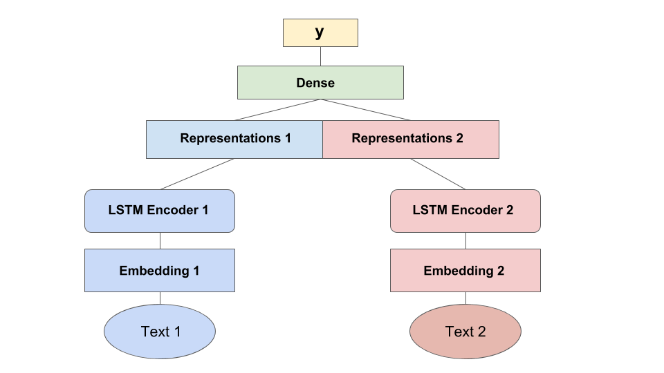

## Text Similarity Using Siamese Deep Neural Network

Siamese neural network is a class of **neural network architectures that contain two or more** **identical** **subnetworks**. *identical* here means they have the same configuration with the same parameters 
and weights. Parameter updating is mirrored across both subnetworks.

It is a keras based implementation of deep siamese Bidirectional LSTM network to capture phrase/sentence similarity using word embeddings.

Below is the architecture description for the same.




#### Install dependencies

`pip install -r requirements.txt`

### Usage

#### Training

```python
from model import SiameseBiLSTM
from inputHandler import word_embed_meta_data, create_test_data
from config import siamese_config
import pandas as pd

############ Data Preperation ##########

df = pd.read_csv('sample_data.csv')

sentences1 = list(df['sentences1'])
sentences2 = list(df['sentences2'])
is_similar = list(df['is_similar'])
del df

######## Word Embedding ############

tokenizer, embedding_matrix = word_embed_meta_data(sentences1 + sentences2,  siamese_config['EMBEDDING_DIM'])

embedding_meta_data = {
	'tokenizer': tokenizer,
	'embedding_matrix': embedding_matrix
}

## creating sentence pairs
sentences_pair = [(x1, x2) for x1, x2 in zip(sentences1, sentences2)]
del sentences1
del sentences2

######## Training ########

class Configuration(object):
    """Dump stuff here"""

CONFIG = Configuration()

CONFIG.embedding_dim = siamese_config['EMBEDDING_DIM']
CONFIG.max_sequence_length = siamese_config['MAX_SEQUENCE_LENGTH']
CONFIG.number_lstm_units = siamese_config['NUMBER_LSTM']
CONFIG.rate_drop_lstm = siamese_config['RATE_DROP_LSTM']
CONFIG.number_dense_units = siamese_config['NUMBER_DENSE_UNITS']
CONFIG.activation_function = siamese_config['ACTIVATION_FUNCTION']
CONFIG.rate_drop_dense = siamese_config['RATE_DROP_DENSE']
CONFIG.validation_split_ratio = siamese_config['VALIDATION_SPLIT']

siamese = SiameseBiLSTM(CONFIG.embedding_dim , CONFIG.max_sequence_length, CONFIG.number_lstm_units , CONFIG.number_dense_units, CONFIG.rate_drop_lstm, CONFIG.rate_drop_dense, CONFIG.activation_function, CONFIG.validation_split_ratio)

best_model_path = siamese.train_model(sentences_pair, is_similar, embedding_meta_data, model_save_directory='./')
```

#### Testing

```python
from operator import itemgetter
from keras.models import load_model

model = load_model(best_model_path)

test_sentence_pairs = [('What can make Physics easy to learn?','How can you make physics easy to learn?'),('How many times a day do a clocks hands overlap?','What does it mean that every time I look at the clock the numbers are the same?')]

test_data_x1, test_data_x2, leaks_test = create_test_data(tokenizer,test_sentence_pairs,  siamese_config['MAX_SEQUENCE_LENGTH'])

preds = list(model.predict([test_data_x1, test_data_x2, leaks_test], verbose=1).ravel())
results = [(x, y, z) for (x, y), z in zip(test_sentence_pairs, preds)]
results.sort(key=itemgetter(2), reverse=True)
print results
```

### References:

1. [Siamese Recurrent Architectures for Learning Sentence Similarity (2016)](https://www.aaai.org/ocs/index.php/AAAI/AAAI16/paper/view/12195)
2. Inspired from Tensorflow Implementation of  https://github.com/dhwajraj/deep-siamese-text-similarity
